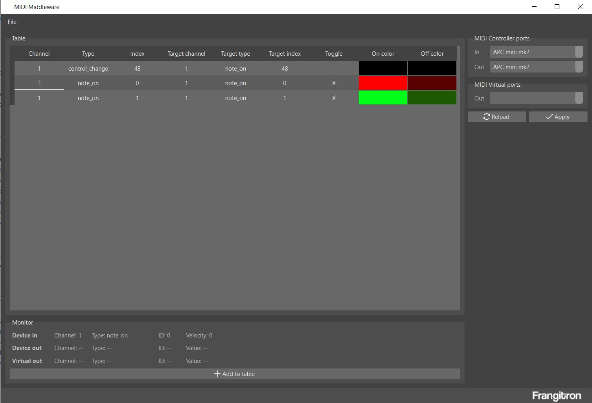

# MIDI Middleware

Basic and easy to use MIDI middleware to enhance your controllers behaviour

## Usage

This software aims at enhancing a MIDI controller's behaviour in a simple way

- Download .exe from releases
- Create a virtual MIDI port (using [loopMIDI](https://www.tobias-erichsen.de/software/loopmidi.html) for example)
- Plug in your APCmini 2 / X-Touch Extender
- Open MIDI Middleware, select ports
- Move/Press your controller's controls
- Add relevant messages to table
- Edit parameters
- Save your project

A quick demo can be found on [Youtube](https://youtu.be/juP7a22mlzY)

## Notes

This project uses [PySide6 helpers](https://github.com/MrFrangipane/pyside6-helpers) which icons were made by [Freepik](https://www.freepik.com/) and found on [Flat Icon](https://www.flaticon.com)
